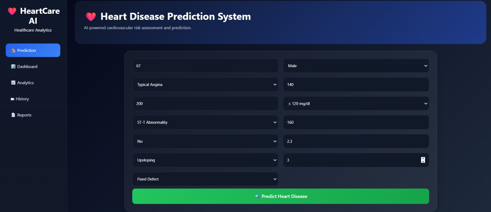
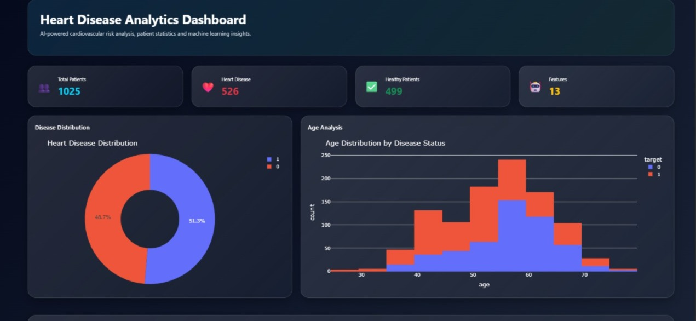
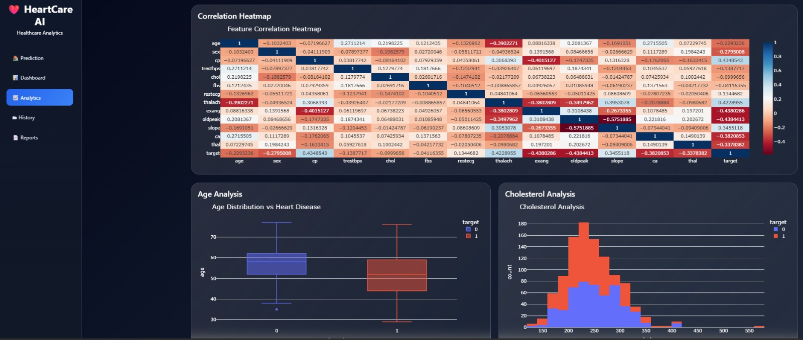
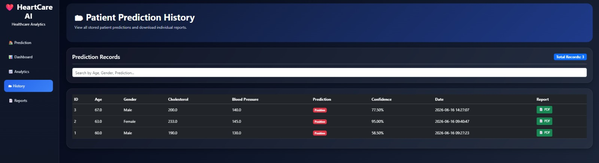
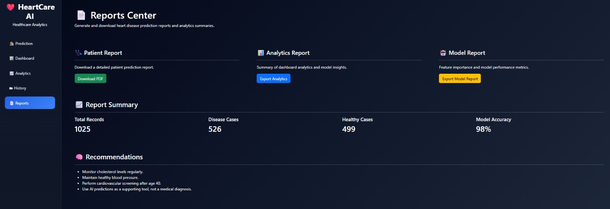

# ❤️ HeartCare AI

## AI-Powered Heart Disease Prediction & Healthcare Analytics Platform

HeartCare AI is a full-stack machine learning web application designed to predict the likelihood of heart disease using clinical patient data. The platform combines predictive analytics, interactive visualizations, patient history management, and professional report generation into a single healthcare dashboard.

---

## 🚀 Features

### ❤️ Heart Disease Prediction

* Machine Learning-based prediction system
* Real-time risk assessment
* Confidence score generation
* Patient-specific prediction results

### 📊 Interactive Dashboard

* Total patient statistics
* Disease vs Healthy distribution
* Age distribution analysis
* Feature importance visualization
* Interactive Plotly charts

### 📈 Advanced Analytics

* Correlation heatmaps
* Data distribution analysis
* Risk factor visualization
* Healthcare insights dashboard

### 🗂 Patient History

* SQLite database integration
* Stores all prediction records
* Search and filter functionality
* Patient-specific report generation

### 📄 Professional Reports

* PDF report generation
* Patient information summary
* Prediction details
* Risk assessment
* Medical recommendations

### 🧠 Explainable AI

* Feature importance analysis
* Model interpretability
* Prediction explanation support

---

## 🛠 Technology Stack

### Backend

* Python
* Flask
* SQLite

### Machine Learning

* Scikit-Learn
* NumPy
* Pandas
* Joblib

### Data Visualization

* Plotly
* Matplotlib
* Seaborn

### Frontend

* HTML5
* CSS3
* Bootstrap 5

### Reporting

* ReportLab

---

## 📷 Application Screenshots

### 🏠 Prediction Page



---

### 📊 Dashboard



---

### 📈 Analytics



---

### 🗂 History



---

### 📄 Reports



---

## 📁 Project Structure

```text
HeartCare-AI
│
├── app.py
├── train_model.py
├── heart.csv
├── database.db
│
├── models
│   ├── heart_model.pkl
│   └── scaler.pkl
│
├── static
│   └── style.css
│
├── templates
│   ├── base.html
│   ├── index.html
│   ├── dashboard.html
│   ├── analytics.html
│   ├── history.html
│   └── reports.html
│
├── screenshots
│   ├── prediction.png
│   ├── dashboard.png
│   ├── analytics.png
│   ├── history.png
│   └── reports.png
│
└── README.md
```

---

## ⚙️ Installation

### Clone Repository

```bash
git clone https://github.com/YOUR_USERNAME/HeartCare-AI.git
```

```bash
cd HeartCare-AI
```

### Install Dependencies

```bash
pip install -r requirements.txt
```

### Run Application

```bash
python app.py
```

Open:

```text
http://127.0.0.1:5000
```

---

## 🎯 Machine Learning Workflow

1. Data Collection
2. Data Preprocessing
3. Feature Scaling
4. Model Training
5. Model Evaluation
6. Model Deployment
7. Prediction & Reporting

---

## 📊 Dataset Features

| Feature  | Description             |
| -------- | ----------------------- |
| age      | Age of patient          |
| sex      | Gender                  |
| cp       | Chest pain type         |
| trestbps | Resting blood pressure  |
| chol     | Cholesterol             |
| fbs      | Fasting blood sugar     |
| restecg  | Rest ECG                |
| thalach  | Maximum heart rate      |
| exang    | Exercise-induced angina |
| oldpeak  | ST depression           |
| slope    | Slope of ST segment     |
| ca       | Number of major vessels |
| thal     | Thalassemia             |
| target   | Heart disease status    |

---

## 🔮 Future Enhancements

* User Authentication
* SHAP Explainability Dashboard
* Email Report Delivery
* Cloud Deployment
* Multi-Disease Prediction
* Doctor Portal
* Patient Management System

---

## 👨‍💻 Author


Developed as a Healthcare Analytics and Machine Learning Project using Flask and Scikit-Learn.

---

## ⭐ Support

If you found this project useful, consider giving it a star on GitHub.
